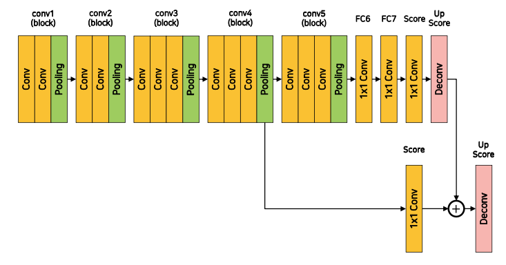

## Peer session
* "UNKNOWN" class에 대한 처리가 중요해보임
    * (종호님) zero-shot object detection을 활용하면 도움이 될 수도 있을듯
        * https://arxiv.org/abs/1804.04340
        * https://paperswithcode.com/task/zero-shot-object-detection
    * 협업 어떤 방식으로 할 지
        * (현우님) Stage 1의 베이스라인처럼 model, inference, util 등으로 파일을 구분하고 각각 내부에 함수나 클래스를 추가하며 config를 바꿔 실험하는 방향으로 통합하면 좋을듯
<br><br>

## 프로젝트 활동
* mIoU score: 0.3061 달성
    * Model: FCN8s
    * 바꾼 hyperparam
        * Resize(256, 256)
        * epoch=5
* ### FCN-16s 모델 구현하기

```python
class FCN16s(nn.Module):
    def __init__(self, num_classes=21):
        super(FCN16s, self).__init__()
        self.relu       = nn.ReLU(inplace=True)

        self.conv1_1    = nn.Conv2d(3, 64, 3, padding=1)
        self.conv1_2    = nn.Conv2d(64, 64, 3, padding=1)
        self.pool1       = nn.MaxPool2d(2, 2, ceil_mode=True)

        self.conv2_1    = nn.Conv2d(64, 128, 3, padding=1)
        self.conv2_2    = nn.Conv2d(128, 128, 3, padding=1)
        self.pool2       = nn.MaxPool2d(2, 2, ceil_mode=True)
        
        self.conv3_1    = nn.Conv2d(128, 256, 3, padding=1)
        self.conv3_2    = nn.Conv2d(256, 256, 3, padding=1)
        self.conv3_3    = nn.Conv2d(256, 256, 3, padding=1)
        self.pool3       = nn.MaxPool2d(2, 2, ceil_mode=True)
        
        self.conv4_1    = nn.Conv2d(256, 512, 3, padding=1)
        self.conv4_2    = nn.Conv2d(512, 512, 3, padding=1)
        self.conv4_3    = nn.Conv2d(512, 512, 3, padding=1)
        self.pool4       = nn.MaxPool2d(2, 2, ceil_mode=True)
        
        self.conv5_1    = nn.Conv2d(512, 512, 3, padding=1)
        self.conv5_2    = nn.Conv2d(512, 512, 3, padding=1)
        self.conv5_3    = nn.Conv2d(512, 512, 3, padding=1)
        self.pool5       = nn.MaxPool2d(2, 2, ceil_mode=True)
        
        self.fc6        = nn.Conv2d(512, 4096, 1)
        self.drop6       = nn.Dropout2d()
        self.fc7        = nn.Conv2d(4096, 4096, 1)
        self.drop7       = nn.Dropout2d()

        self.score_fr   = nn.Conv2d(4096, num_classes, 1)
        self.skip_score = nn.Conv2d(512, num_classes, 1)

        self.upscore2   = nn.ConvTranspose2d(num_classes, num_classes, 4, stride=2, padding=1)
        self.upscore16  = nn.ConvTranspose2d(num_classes, num_classes, 32, stride=16, padding=8)

    def forward(self, x):
        x = self.relu(self.conv1_1(x))
        x = self.relu(self.conv1_2(x))
        x = self.pool1(x)

        x = self.relu(self.conv2_1(x))
        x = self.relu(self.conv2_2(x))
        x = self.pool2(x)

        x = self.relu(self.conv3_1(x))
        x = self.relu(self.conv3_2(x))
        x = self.relu(self.conv3_3(x))
        x = self.pool3(x)

        x = self.relu(self.conv4_1(x))
        x = self.relu(self.conv4_2(x))
        x = self.relu(self.conv4_3(x))
        x = self.pool4(x)
        skip = x

        x = self.relu(self.conv5_1(x))
        x = self.relu(self.conv5_2(x))
        x = self.relu(self.conv5_3(x))
        x = self.pool5(x)

        x = self.drop6(self.fc6(x))
        x = self.drop7(self.fc7(x))
        x = self.score_fr(x)
        x = self.upscore2(x)

        skip = self.skip_score(skip)
        x = x + skip
        x = self.upscore16(x)

        return x
```
<br><br>

## 강의
* COCO Dataset
    * Image files
    * data.json
        * info
            * year, version, description, contributor, url, date_created
        * licenses
            * id, name, url
        * images
            * width, height, file_name, license, flickr_url, coco_url, data_captured, id
        * categories (only train)
            * id, name, supercategory
        * annotations (only train)
            * image_id, category_id, segmentation, area, bbox, iscrowd, id
* Target
    * Segmentation
        * images: (batch, 3, height, width)
        * targets: (batch, height, width)
    * Object detection
        * images: (batch, 3, height, width)
        * targets:
            * image_id
            * boxes: (x_min, y_min, x_max, y_max)
            * labels
            * area: box의 면적. IoU를 쉽게 구하기 위함
            * iscrowd: object가 너무 많아 하나의 군집으로 labeling 여부
* Metric
    * mAP (mean Average Precision)
        * precision = $\frac{TP}{TP + FP}$ = $\frac{TP}{\text{All Detections}}$
        * recall = $\frac{TP}{TP + FN}$ = $\frac{TP}{\text{All Ground Truths}}$
        * PR curve
            * confidence(예측 확신 정도)가 높은 순으로 정렬 후 TP, FP를 누적해가며 precision, recall을 각각 계산
            * precision, recall을 세로, 가로로 놓고 좌표평면에 대응하는 선을 그리면 PR curve
        * AP (Avergage Precision)
            * PR curve 아래 면적
        * 모든 클래스에 대해서 AP를 구해서 클래스 개수로 나눠주면 mAP
            * mAP = $\frac{1}{n} \sum_{k=1}^{k=n} AP_k$
            * (n: class 개수)
    * mIoU
        * 모든 클래스에 대해서, 각각 Ground truth와 Predict의 픽셀별 교집합/합집합을 구한 뒤 클래스 개수로 나눈 값
        * $\frac{\vert X \cap Y \vert}{\vert X \cup Y \vert}$
* Segmentation
    * 마케팅 분야: "비슷한 성향을 가진 소비자들을 묶는 작업"
    * 이미지 분야: 비슷한 픽셀들을 묶는 작업
    * 다른 분야와 비교
        * Single object
            * classification, localization
        * Multi object
            * detection, segmentation
* FCN
    * Backbone: VGGNet
    * FC layer를 convolution layer로 대체
        * 각 픽셀의 위치정보를 보존한 채 특징 추출
        * 임의의 입력 사이즈(height, width)에 상관 없이 연산
    * transposed convolution(upsampling, deconvolution)을 이용해 pixel wise prediction 수행
    * Models 
        * FCN-32s
            * 5 pooling layers $\rightarrow$ x32 upsample
        * FCN-16s
            * FCN-32s + conv4 layer skip connection
        * FCN-8s
            * FCN-16s + conv3 layer skip connection
    * Metric
        * Pixel accuracy
            * $\frac{\text{True pixel}}{\text{Total pixel}}$
        * Mean IoU
            * 클래스별 $\frac{\text{Ground Truth } \cap \text{ Predict}}{\text{Ground Truth } \cup \text{ Predict}}$ 평균
<br><br>