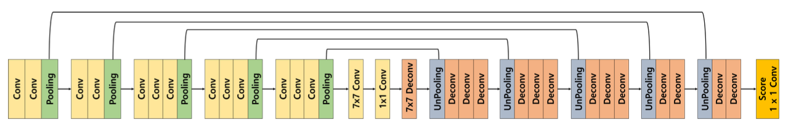

## Peer session
* 토론, 의견 나눔
    * 어제 과제
    * 베이스라인 코드
        * (현우님) 자동으로 output 파일을 리더보드에 제출하는 submit.py 파일 구현 후 공유 (description 값도 지정 가능한 version)
    * Git
        * 팀 repository에 각자 branch 생성
<br><br>

## 오피스 아워
* My Question
    * unknown 클래스가 "기타 등등"의 의미라면, 학습에서 unknown 클래스를 제외하고 inference 시 11개 클래스 중 confident하게 예측되는 것이 없을 경우에 unknown으로 예측하는 방법도 의미 있는 시도가 될까요?
        * 답변: 재미있는 생각인데, unknown 클래스의 유형과 분포가 굉장히 다양하고 종잡을 수 없다면 의미 있는 시도가 될 것 같다. 엄밀한 EDA를 통해 데이터 분포를 파악한 뒤 고려해볼 것을 추천한다.
<br><br>

## 프로젝트 활동
* mIoU score: 0.3170 달성
    * Model: DeconvNet
    * 바꾼 hyperparam
        * Resize(256, 256)
        * epoch=10
* ### DeconvNet 모델 구현하기

```python
def CBR(in_channels, out_channels, kernel_size=3, stride=1, padding=1):
    return nn.Sequential(nn.Conv2d(in_channels, out_channels, kernel_size, stride, padding),
                         nn.BatchNorm2d(out_channels),
                         nn.ReLU())

def DCB(in_channels, out_channels, kernel_size=3, stride=1, padding=1):
    return nn.Sequential(nn.ConvTranspose2d(in_channels, out_channels, kernel_size, stride, padding),
                         nn.BatchNorm2d(out_channels),
                         nn.ReLU())

class DeconvNet(nn.Module):
    def __init__(self, num_classes=21):
        super(DeconvNet, self).__init__()
        self.pretrained_model = vgg16(pretrained = True)
        features, classifiers = list(self.pretrained_model.features.children()), list(self.pretrained_model.classifier.children())

        self.conv1 = nn.Sequential(*features[:4])
        self.pool1 = nn.MaxPool2d(2, 2, ceil_mode=True, return_indices=True)
        
        self.conv2 = nn.Sequential(*features[5:9])
        self.pool2 = nn.MaxPool2d(2, 2, ceil_mode=True, return_indices=True)
        
        self.conv3 = nn.Sequential(*features[10:16])
        self.pool3 = nn.MaxPool2d(2, 2, ceil_mode=True, return_indices=True)
        
        self.conv4 = nn.Sequential(*features[17:23])
        self.pool4 = nn.MaxPool2d(2, 2, ceil_mode=True, return_indices=True)
        
        self.conv5 = nn.Sequential(*features[24:30])
        self.pool5 = nn.MaxPool2d(2, 2, ceil_mode=True, return_indices=True)
        
        self.fc6 = CBR(512, 4096, 7, 1, 0)
        self.drop6 = nn.Dropout2d(0.5)
        self.fc7 = CBR(4096, 4096, 1, 1, 0)
        self.drop7 = nn.Dropout2d(0.5)
        self.fc6_deconv = DCB(4096, 512, 7, 1, 0)
        
        self.unpool5 = nn.MaxUnpool2d(2, 2)
        self.deconv5_1 = DCB(512, 512)
        self.deconv5_2 = DCB(512, 512)
        self.deconv5_3 = DCB(512, 512)
        
        self.unpool4 = nn.MaxUnpool2d(2, 2)
        self.deconv4_1 = DCB(512, 512)
        self.deconv4_2 = DCB(512, 512)
        self.deconv4_3 = DCB(512, 256)
        
        self.unpool3 = nn.MaxUnpool2d(2, 2)
        self.deconv3_1 = DCB(256, 256)
        self.deconv3_2 = DCB(256, 256)
        self.deconv3_3 = DCB(256, 128)
        
        self.unpool2 = nn.MaxUnpool2d(2, 2)
        self.deconv2_1 = DCB(128, 128)
        self.deconv2_2 = DCB(128, 64)
        
        self.unpool1 = nn.MaxUnpool2d(2, 2)
        self.deconv1_1 = DCB(64, 64)
        self.deconv1_2 = DCB(64, 64)
        
        self.score_fr = nn.Conv2d(64, num_classes, 1, 1, 0, 1)
        
    def forward(self, x):
        x = self.conv1(x)
        x, pool1_indices = self.pool1(x)
        x = self.conv2(x)
        x, pool2_indices = self.pool2(x)
        x = self.conv3(x)
        x, pool3_indices = self.pool3(x)
        x = self.conv4(x)
        x, pool4_indices = self.pool4(x)
        x = self.conv5(x)
        x, pool5_indices = self.pool5(x)
        
        x = self.drop6(self.fc6(x))
        x = self.drop7(self.fc7(x))
        
        x = self.fc6_deconv(x)
        
        x = self.unpool5(x, pool5_indices)
        x = self.deconv5_1(x)
        x = self.deconv5_2(x)
        x = self.deconv5_3(x)
        
        x = self.unpool4(x, pool4_indices)
        x = self.deconv4_1(x)
        x = self.deconv4_2(x)
        x = self.deconv4_3(x)

        x = self.unpool3(x, pool3_indices)
        x = self.deconv3_1(x)
        x = self.deconv3_2(x)
        x = self.deconv3_3(x)
        
        x = self.unpool2(x, pool2_indices)
        x = self.deconv2_1(x)
        x = self.deconv2_2(x)
        
        x = self.unpool1(x, pool1_indices)
        x = self.deconv1_1(x)
        x = self.deconv1_2(x)
        
        x = self.score_fr(x)
        
        return x
```
<br><br>

## 강의
* ### FCN의 한계점
    * 객체의 크기가 크거나 작은 경우 예측 잘 못함
        * 큰 객체의 경우 지역적 정보만으로 예측
        * 같은 객체도 다르게 labeling
        * 작은 객체 무시되는 경우 발생
    * 객체의 디테일한 모습이 사라지는 문제 (경계 학습 어려움)
* ### Decoder를 개선한 models
    * DeconvNet
        * Decoder를 Encoder와 대칭으로 만든 형태
        * Unpooling
            * MaxPool 시 max 값의 인덱스 정보를 저장 후 unpool 시 복원
            * max index가 아닌 부분이 0으로 채워져 sparse activation map을 가지기 때문에, transposed convolution을 수행해 채워줌
            * example-specific (자세한) 구조를 잡아냄
        * Deconvolution
            * (=transposed convolution)
            * input object의 모양 복원
            * unpooled된 구조에 빈 부분을 채워 넣어 class-specific한 구조를 잡아냄
        * 얕은 층의 경우 전반적 모습을, 깊은 층의 경우 구체적인 모습을 잡아냄
    * SegNet
        * Road scene understanding application 분야에서 (real-time) semantic segmentation 수행
        * DeconvNet과 비슷하지만, 중간에 7x7conv 1x1conv 7x7deconv 레이어가 없고, decoder 부분에 deconv 대신 conv가 쓰임
        * weight parameter 수가 감소해 학습 및 추론 시간이 빠름
* ### Skip connection을 적용한 models
    * FC DenseNet
    * Unet
* ### Receptive field를 확장시킨 models
    * DeepLab v1
        * Dilated convolution
            * conv와 conv 사이 max pooling을 넣으면 receptive field를 넓힐 수 있지만, 다시 이미지 원본 사이즈로 upsample 시 resolution이 낮아짐 (low feature resolution)
            * filter size를 키워도 receptive field를 넓힐 수 있지만, 파라미터 수가 폭증함
            * dilated convolution (atrous convolution)을 이용하면 이 문제들을 겪지 않으면서 receptive field 넓힐 수 있음
            * [그림](https://github.com/vdumoulin/conv_arithmetic/blob/master/gif/dilation.gif)
        * Bilinear interpolation
            * upsample 시 0으로 채우는 것이 아니라, 근처 값들과 가까울 수록 그 값과 비슷하게 채움 (내분)
            * $(7, \square, \square, 9)$
                * $\frac{4}{2+4} \times 7 + \frac{2}{2+4} \times 9 = 7.66$
                * $\frac{2}{2+4} \times 7 + \frac{4}{2+4} \times 9 = 8.33$
                * $(7, 7.66, 8.33, 9)$
    * DilatedNet
        * Front + Basic context module(다양한 conv rate를 준 conv layer들의 block)
    * DeepLab v2
        * Multi-scale image (다양한 conv rate를 준 conv layer들을 병렬로 배치)
            * ASPP (Parallel moduels with atrous convolution)
    * PSPNet
        * 도입 배경 (문제점들)
            * mismatched relationship
            * confusion categories
            * inconspicous(불명확한) classes
        * Global average pooling
            * 주변 정보 (문맥)을 파악해 객체 예측에 사용
            * 여러 개를 병렬로 묶어 pyramid pooling module 사용
    * DeepLab v3
        * ASPP, augmented with image-level features (DeepLab v2 + global average pooling)
<br><br>