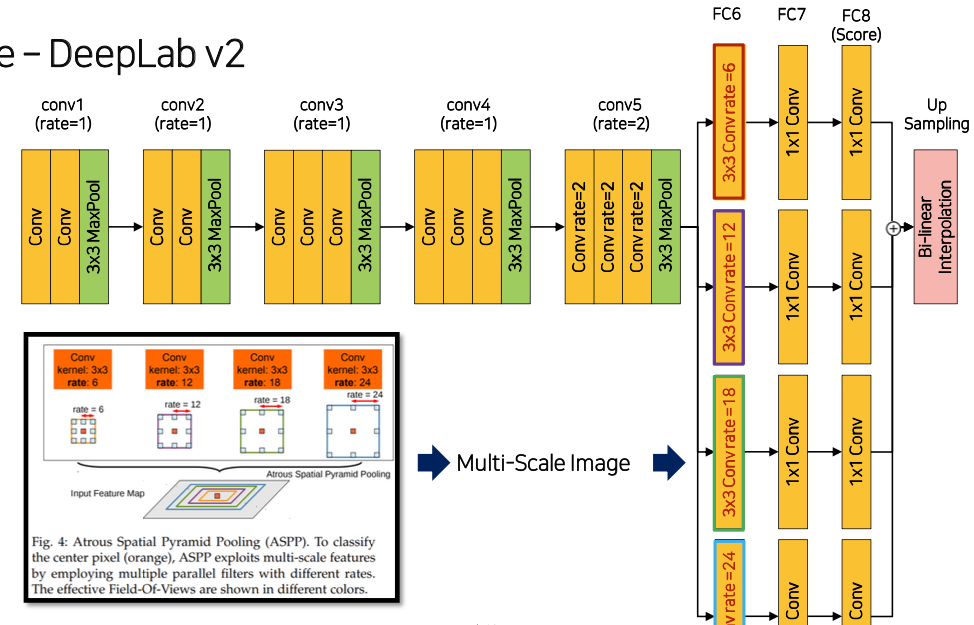

## Peer session
* DeepLab v3 backbone model에 따른 성능
    * (철환님) 커스텀으로 구현해서 백본 모델을 쉽게 갈아낄 수 있도록 만든 후 실험
        * vgg, resnet, efficientnet 순으로 점점 성능 높아짐. efficientnet 내에서도 여러 모델을 돌려봤지만 깊고 복잡하다고 성능이 비례해서 올라가진 않음
* (my) DeepLab v3에서 ASPP conv, ASPP pooling를 concat한다고 하는데, shape은 어떻게 맞추는지
    * (철환님) 채널을 축으로 concat하기 때문에 batch, height, width를 맞춰야하는데 ASPP에서 다른 rate의 dilated convolution의 경우 padding도 rate와 동일하게 설정되어 있기 때문에 output size 같음. average pooling 시 1x1이 나오는데 이것만 size 키워주면 됨
* Stratified K-fold for segmentation
    * 마스터님 답변: 한 사진 내에 여러 object가 등장하는 multi label 문제가 있기 때문에 단순히 classification처럼 stratified K-fold 사용 시 문제 있음.
        1. train / val에 총 등장하는 object 개수 비슷하게
        2. train / val의 class balance를 비슷하게 
<br><br>

## 프로젝트 활동
* ### DeepLab v2 모델 구현하기


    ```python
    def conv3x3_relu(in_ch, out_ch, rate=1):
        conv3x3_relu = nn.Sequential(nn.Conv2d(in_ch, 
                                            out_ch,
                                            kernel_size=3, 
                                            stride=1,
                                            padding=rate,
                                            dilation=rate),
                                    nn.ReLU())
        return conv3x3_relu


    class VGG16(nn.Module):
        def __init__(self):
            super(VGG16, self).__init__()
            self.pretrained_model = vgg16(pretrained=True)
            features = list(self.pretrained_model.features.children())
            
            self.conv1 = nn.Sequential(*features[:4])
            self.pool1 = nn.MaxPool2d(3, 2, 1)
            
            self.conv2 = nn.Sequential(*features[5:9])
            self.pool2 = nn.MaxPool2d(3, 2, 1)
            
            self.conv3 = nn.Sequential(*features[10:16])
            self.pool3 = nn.MaxPool2d(3, 2, 1)
            
            self.conv4 = nn.Sequential(*features[17:23])
            self.pool4 = nn.MaxPool2d(3, 1, 1)
            
            # dilated convolution block
            self.conv5_1 = conv3x3_relu(512, 512, rate=2)
            self.conv5_2 = conv3x3_relu(512, 512, rate=2)
            self.conv5_3 = conv3x3_relu(512, 512, rate=2)
            self.pool5 = nn.MaxPool2d(3, 1, 1)

        def forward(self, x):
            x = self.conv1(x)
            x = self.pool1(x)
            x = self.conv2(x)
            x = self.pool2(x)
            x = self.conv3(x)
            x = self.pool3(x)
            x = self.conv4(x)
            x = self.pool4(x)
            x = self.conv5_1(x)
            x = self.conv5_2(x)
            x = self.conv5_3(x)
            x = self.pool5(x)
            
            return x

        
    class ASPP(nn.Module):
        def __init__(self, in_channels, out_channels=1024, num_classes=21):
            super(ASPP, self).__init__()

            # FC6
            self.conv3x3_dilate6 = conv3x3_relu(in_channels, out_channels, rate=6)
            self.conv3x3_dilate12 = conv3x3_relu(in_channels, out_channels, rate=12)
            self.conv3x3_dilate18 = conv3x3_relu(in_channels, out_channels, rate=18)
            self.conv3x3_dilate24 = conv3x3_relu(in_channels, out_channels, rate=24)
            
            self.drop3x3 = nn.Dropout2d(0.5)
            self.drop1x1 = nn.Dropout2d(0.5)
            
            # FC7, score
            self.conv1x1 = nn.Conv2d(out_channels, out_channels, 1)
            self.score = nn.Conv2d(out_channels, num_classes, 1)


        def forward(self, x):
            branch1 = self.drop3x3(self.conv3x3_dilate6(x))
            branch1 = self.drop1x1(self.conv1x1(branch1))
            branch1 = self.score(branch1)
            
            branch2 = self.drop3x3(self.conv3x3_dilate12(x))
            branch2 = self.drop1x1(self.conv1x1(branch2))
            branch2 = self.score(branch2)

            branch3 = self.drop3x3(self.conv3x3_dilate18(x))
            branch3 = self.drop1x1(self.conv1x1(branch3))
            branch3 = self.score(branch3)
            
            branch4 = self.drop3x3(self.conv3x3_dilate24(x))
            branch4 = self.drop1x1(self.conv1x1(branch4))
            branch4 = self.score(branch4)

            return sum([branch1, branch2, branch3, branch4])

        
    class DeepLabV2(nn.Module):
        ## VGG 위에 ASPP 쌓기
        def __init__(self, backbone, classifier, upsampling=8):
            super(DeepLabV2, self).__init__()
            self.backbone = backbone
            self.classifier = classifier
            self.upsampling = upsampling

        def forward(self, x):
            x = self.backbone(x)
            _, _, fm_height, fm_width = x.size()
            x = self.classifier(x)
            out = F.interpolate(x, size=(fm_height * self.upsampling, fm_width * self.upsampling), mode='bilinear')
            
            return out
    ```
<br><br>