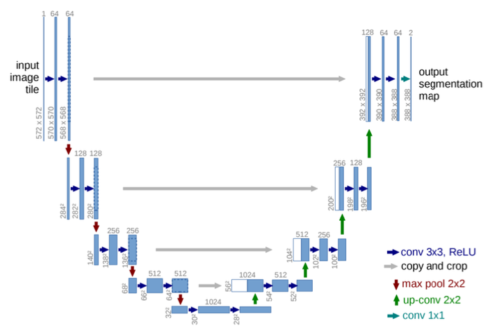
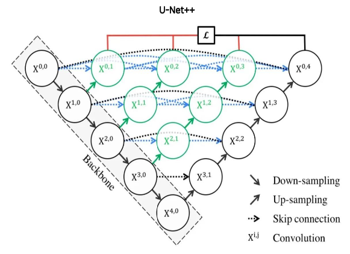
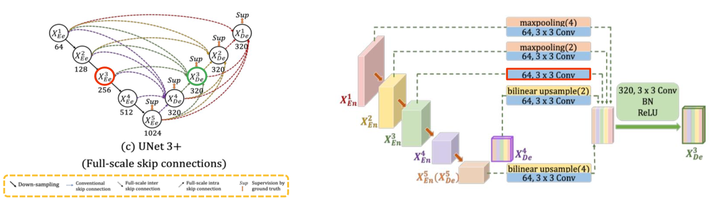

## Peer session
* Random Elastic deformations으로 찌그러진 쓰레기 이미지 생성 (Augmentation) 가능할듯
    * (my) 적은 비율의 class에 집중 적용해서 class imbalance 문제 해결에 큰 도움이 될 것 같음
* (철환님) resize를 작게 주고 batchsize를 올리면 성능 향상이 있을 지도
    * (my) batchsize가 성능에 영향을 주는 건 맞지만, 지난 프로젝트에서 resize를 작게 주고 batch를 크게 줬을 때 결과적으로 더 성능이 안 나온 경험이 있다. 또 DeepLab 같은 모델이 receptive field를 키우는 전략으로 성능을 높인 것인데, resize를 통해 원본 이미지 사이즈가 작아진다면 결과적으로 receptive field를 키운 영향력이 상쇄되어 성능이 떨어질 것 같음
  

## 프로젝트 활동
* mIoU score: 0.5623 달성 (Rank 24 /115)
    * Model: DeepLab v3 (resnet101 pretrained)
    * hyperparam
        * epoch=19
        * batchsize=8
        * lr=5e-5
        * transform
            * resnet기준 normalize
  

## 강의
* ### U-Net
    * Intro
        * 2015 biomedical 분야에서 등장
        * 의료 계열에서 문제 상황
            * train data 수가 부족
            * 같은 클래스가 인접한 셀 구분이 어려움 (일반적인 semantic segmentation에서는 불가능)
    * Architecture
        
        * Contracting path
            * down-sampling
            * context 포착 (입력 이미지(tile형태로 조각냄)의 전반적 특징 추출)
            * 구성
                * (3x3 Conv, BN, ReLU) x 2 (no zero-padding)
                * 2x2 Max pooling (stride=2) (채널 수 2배)
        * Expanding path 
            * up-sampling
            * localization 가능케 함 (얕은 layer의 feature map 결합)
            * 구성
                * 2x2 Up-Conv (transposed conv) (feature map 크기 2배, 채널 수 1/2배)
                * Skip connection: contracting에서 얻은 feature map과 concat
                * (3x3 Conv, BN, ReLU) x 2 (no zero-padding)
    * Contribution
        * Encoder가 확장함에 따라 채널 수를 1024까지 증가시켜, 더 고차원에서 정보를 매핑
        * 각기 다른 계층의 인코더 출력을 디코더와 결합해 (skip connection), 이전 레이어의 정보를 효율적으로 활용
    * Techniques
        * Data augmentation
            * random elastic deformation
                * 모델이 invariance, robustness 학습
        * Sliding window
            * 이미지 n등분해서 학습
            * 배경만 있는 윈도우, 객체 잘리는 부분, 겹치는 영역 존재하는 문제들을 해결해 적용
        * Pixel-wise loss weight를 계산하기 위한 weight map 생성
            * 같은 클래스를 가지는 인접한 셀을 분리하기 위해 해당 경계 부분에 가중치 제공
    * 한계점
        * 깊이가 4로 고정됨
            * 데이터셋마다 최고 성능 보장 x
            * ensemble 비용 증가
        * 단순한 skip connection
            * 동일한 깊이를 가지는 encoder와 decoder만 연결되는 제한적 구조
* ### U-Net++
    
    * 특징
        * Deep skip connection
        * Ensemble
            * depth가 1, 2, 3, 4인 U-Net 모델들을 앙상블한 효과
        * Deep supervision
            * hybrid loss (Pixel-wise Cross Entropy + Soft Dice Coefficient)
    * 한계점
        * 복잡한 connection으로 파라미터 급증, 메모리 증가
        * Encoder-decoder 사이에서 connection이 동일한 크기의 feature map에서만 진행됨 (full scale에서 충분한 정보를 탐색하지 못해, 위치와 경계를 명시적으로 학습하지 못함)
* ### U-Net 3+
    
    * 특징
        * Full-scale skip connection
            * conventional (simple), inter, intra skip connections
    * Techniques
        * Classification-Guided Module (CGM)
        * Full-scale deep supervision
            * 3가지 loss term 결합
            * $L_{seg} = L_{f1} + L_{ms-ssim} + L_{iou}$
                * $L_{iou} = 1 - IoU = 1 - \frac{TP}{FP + TP + FN}$ (픽셀의 분류 정확도 상승)
* Other versions
    * Residual U-Net
    * Mobile-UNet
    * Eff-UNet
  