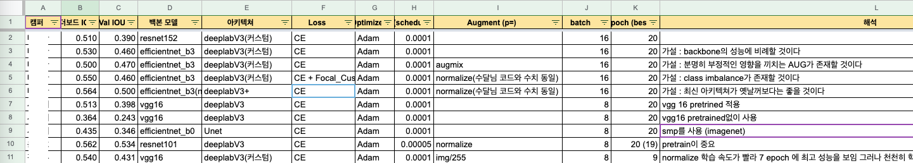
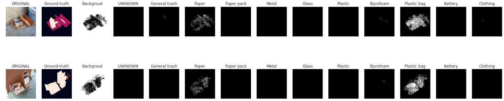

## Peer session
* 실험 노트 팀 단위 공유 (현우님 아이디어)
    
    * [실험 노트 링크](https://docs.google.com/spreadsheets/d/1fgz2OTDS8Vzn7plbNVCt062fSE8T-RfWptqRZf9RpV8/edit#gid=0)
* (종호님) Validation 마다 어떤 클래스가 어떤 부분에서 잘 못 segmentation하는지 살펴볼 수 있으면 좋을 것 같음
    * (나) 아주 좋은 의견. 이를 확인하면서 augmentation이나 loss를 실험할 때 어떤 방향으로 진행해야하는지 그 선택지를 많이 줄여줄 수 있을 거 같음. tensorboard나 wandb 서버에 validation 시 image, model(image)의 결과, label masks 데이터를 보내 시각적으로 확인할 수 있을 거 같음. 구현해서 공유할 예정.
* (철환님) unknown 클래스를 background로 취급해서 학습할 수도 있지 않을까?
    * (나) background는 아주 특징 학습이 잘 되는 클래스인데, 다양한 object들이 포함된 unknown 클래스를 같이 묶어서 학습하게 된다면 성능이 떨어질 것이라고 생각함. unknown 클래스가 너무 특징의 규칙성이 없고 잡다하다면, unknown을 1개가 아닌 여러 개의 클래스로 분할해서 학습하고 inference 시 하나로 묶는 것도 가능할 듯. 하지만 손수 일일이 레이블링이 필요할 듯.
* (철환님) loss 계산시, segmentation 경계에서 틀린 픽셀에 대해서 더 가중치를 줄 수 있는 방법이 있을까? (focal loss에서 착안)
    * (나) 매우 좋은 아이디어라고 생각. 각자 관련 자료를 찾아봅시다.
<br><br>

## 프로젝트 활동
* Train 혹은 validation 시 모델의 inference를 시각화하는 함수 구현.
    * Ground-truth처럼 한 이미지에 모든 클래스를 표현하는 버전과, 각 클래스별로 이미지를 출력하는 버전을 만듦.
    
        ```python
        for imgs, masks, image_infos in train_loader:
            image_infos = image_infos
            temp_images = imgs
            temp_masks = masks
            
            model.eval()
            outs = model(torch.stack(temp_images).to(device))
            oms = torch.argmax(outs.squeeze(), dim=1).detach().cpu().numpy()
            break

        fig, axs = plt.subplots(nrows=4, ncols=14, figsize=(28, 14))

        for idx in range(4):
            axs[idx, 0].imshow(temp_images[idx].permute([1,2,0]))
            axs[idx, 0].set_title('ORIGINAL')
            axs[idx, 0].axis('off')
            
            # show ground-truth
            axs[idx, 1].imshow(temp_masks[idx])
            axs[idx, 1].set_title('Ground-truth')
            axs[idx, 1].axis('off')
                
            '''
            # show inference (ground-truth style version)
            infer = oms[idx]
            axs[idx, 2].imshow(torch.Tensor(infer))
            axs[idx, 2].set_title('Inference')
            axs[idx, 2].axis('off')
            '''

            # show inference (each class version)
            temp_label = np.zeros((12, 256, 256))
            for label in range(12):
                for i in range(256):
                    for j in range(256):
                        if oms[idx][i][j] == label:
                            temp_label[label][i][j] = 100
                axs[idx, label+2].imshow(temp_label[label], cmap='gray')
                axs[idx, label+2].set_title(category_names[label])
                axs[idx, label+2].axis('off')

        plt.show()
        ```
<br><br>

## 강의
* ### EfficientUnet
    * baseline 이후 실험해볼 사항
        * 좋은 validation
            * hold out 보다는 (stratified, group) k-fold
        * Augmentation
            * cutout, grid mask, cutmix, snapmix, ...
        * SOTA (state of the art) model
            * HRNet, ...
        * Scheduler
            * CosineAnnealingLR, ReduceLROnPlateau, GradualWarmup
        * Batch size up
            * Gradient accumulation (효과), mixed-precision (메모리 효율)
        * Optimizer
            * AdamW, AdamP, Radam, Lookahead (adam, sgd로 k번 업데이트 후 처음 시작한 방향으로 1 step back $\rightarrow$ local minima 빠져나오기 수월)
        * Ensemble
            * k-fold, epoch ensemble, SWA (stochastic weight averaging, 일정 주기마다 weight를 평균 내어 일반화 성능 향상), seed ensemble, resize ensemble, TTA
        * pseudo labeling
            * confident 높게 예측하는 test dat를 train data에 포함해 학습
<br><br>