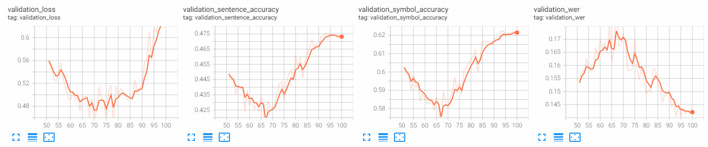

## Peer session

### 한일
 - 배철환 (강의 안들은 사람 :+1::+1:)
     - SRN 배치 10 으로 돌아감
     - Loss 포팅이 남아 있음
 - 조호성
     - 서버 저장이 안됨
     - 토론 게시판에 올려도 답변이 없음
     - deformable는 일반화가 잘되는것같다
         - attention에서보여진다.
         - dropout을 크게 주는 방법
     - SATRN+deformable가 validation좋게 나오는중
 - 임기홍
     - 오늘 강의 한번에 이해안가서 한번더 보는 중
     - CNN단 pretrained model..적용하는중..(Text용 Pretrained model)
 - 서준배
     - 강의에서 SATRN확인
     - 왜 다르게 만든건지...
     - 원래대로 만들어도 좋아지는지?
         - 원래대로 하면 좋아진다고 말씀하시는데 근거는?
     - 원본이랑 왜 다르게 하는지 알 수 없음
         - 달라도 잘돌아가네...
 - 김현우
     - SATRN rotate 넣으면 51 에폭에서 성능이 떨어짐
     - 강의 다시 듣는중
 - 윤준호 (나)
     - 50에폭 학습 후 살짝 튜닝해서 재학습 중
         - augmentation에 GaussianBlur 포함
         - lr 낮춤
         - teacher_forcing 낮춤
         - 50에폭~70에폭 계속 val score 떨어지는 중

### 질문
- 50epoch에서 떨어지는 현상이 나옴
    - 
        - 30epoch은 버리는생각으로 학습을 해야할듯
        - 67부터 상승
    - 대부분 이상 현상
    - 스케줄러?
    - local minimum?
        - 왜지....
    - 학습때가 아니고, 50+50일때 코드상의 문제?
        - 처음부터 100으로 했으면 안나올듯
    - 재학습에서 생김
    - momentum때문에?
        - adam이니까
        - 중간에 momentum이 사라져서 local에 떨어진다.
    - save model vs state dict
        - state dict는 하이퍼파리미터까지 저장이 된다
    - 100epoch과 비교?
    - 재학습 자체의 문제인가
    - cyclic lr이 이상한거같다...

- SRNloss문제
    - predict, word, gsrm로 나온 예측에 대해 따로? 한꺼번에?
    - label은[배치,256(최대길이)]형식
    - word는 [배치,최대길이,244], gsrm은[배치,최대길이,245]
        - [4,244]가 와야되는데 [4,256]이 왔다고 오류
        - 왜 [4,244]를 받은건지? 순서가 달라짐

### 해볼 거
- 200epoch(attention)해서 재학습거랑 
    - 50epoch에서 어떻게 될지
- srn포팅
- satrn분석
    - 원래방식이 더좋은지?
- 스케줄러 바꿔보기! (cyclic 스케줄러 주기가 50에폭이었음...)

### 참고
optimizer state dict 정보:
https://pytorch.org/tutorials/beginner/saving_loading_models.html

